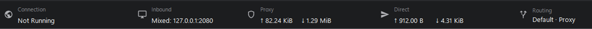
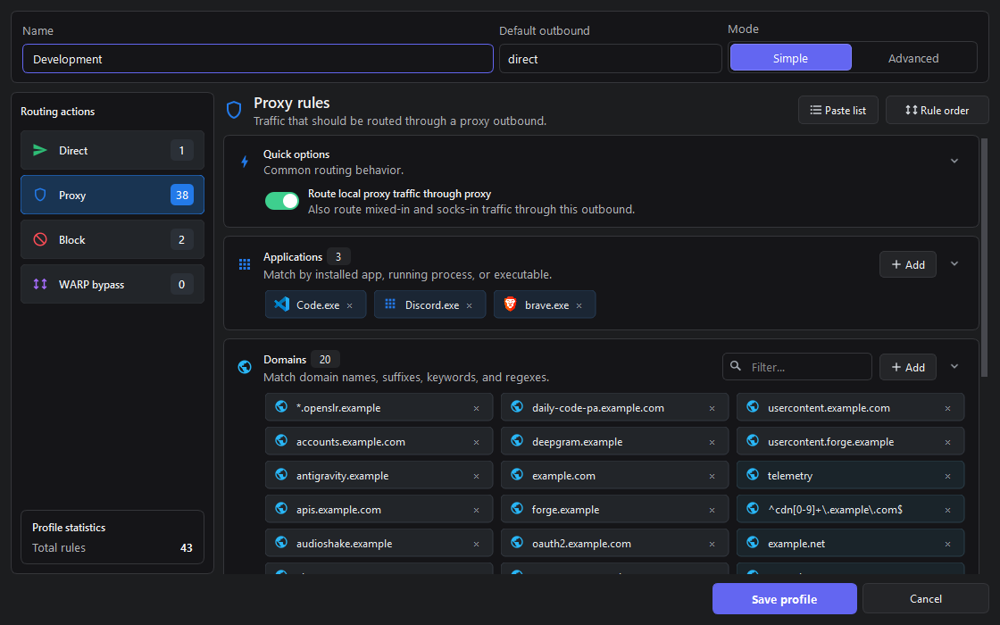
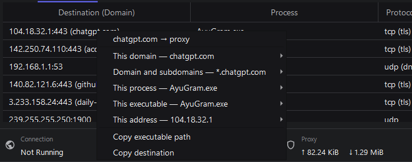
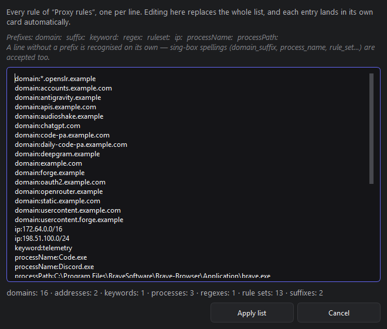
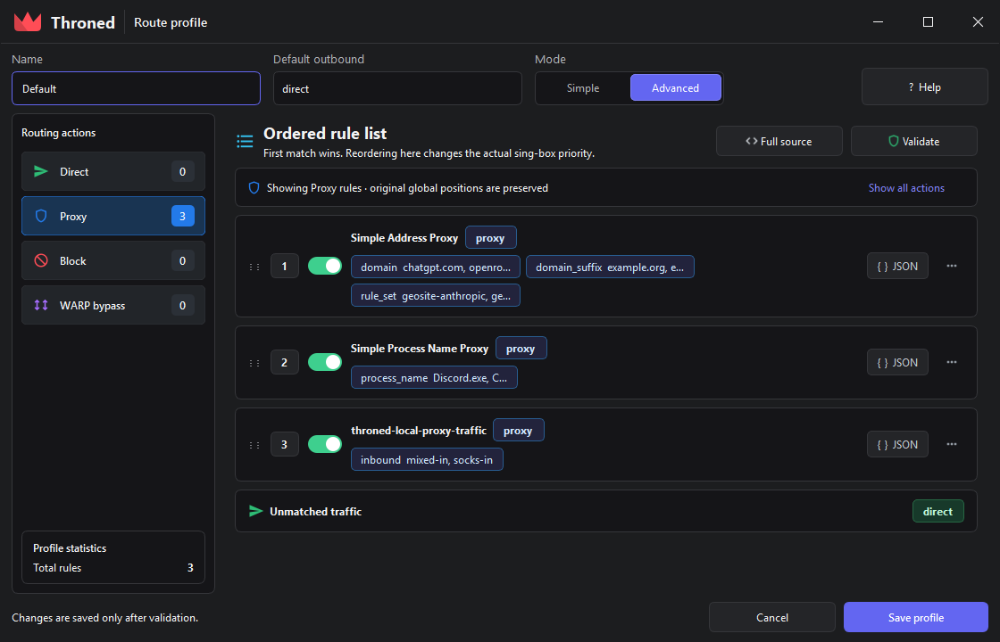

<p align="center">
  
</p>

<h1 align="center">Throned</h1>

<p align="center">
  A Qt desktop proxy client powered by sing-box and Xray —<br>
  my personal, unofficial fork of <a href="https://github.com/throneproj/Throne">Throne</a>.
</p>

<p align="center">
  <a href="https://github.com/troshkindm/throned/releases"></a>
  <a href="LICENSE"></a>
  
</p>

---

## Why this fork exists

I maintain Throned because I wanted to fix a few problems that affected me
directly, test those changes on Windows and Linux, and publish installers I can
actually use without waiting for a particular upstream release.

This project uses AI-assisted tools extensively while developing, reviewing, and
documenting changes. I still test releases before publishing them, but this is a
personal best-effort project — not an official Throne build, and not a promise of
support. If you need the upstream project and its support channels, please use
[Throne](https://github.com/throneproj/Throne). Throned is provided as-is,
without warranty.

---

## Interface

Throned 1.2 replaces the inherited Qt forms with a redesigned shell: a frameless
window with its own chrome, a single header band instead of stacked panels, and
one set of semantic color tokens shared by every screen.

<p align="center">
  
</p>

The status strip is a caption/value grid: connection and exit country, inbound
address, proxy and direct rates, and the active routing profile.

<p align="center">
  
</p>

Routing has a **Simple** mode that sorts rules into application, domain,
rule-set and address cards, and an **Advanced** mode that exposes the real
ordered rule list where the first match wins.

<p align="center">
  
</p>

Settings are grouped into sections with inline help instead of a dense grid of
checkboxes.

<p align="center">
  
</p>

> Screens are rendered from the application itself; the settings screen and the
> theme swatches come from the bundled harness (`tools/ui-demo`). Every server,
> host and path is placeholder data using the reserved documentation ranges from
> RFC 5737.

### Themes

Five built-in themes, switchable in **Settings → Appearance**. The background
ramp stays close to neutral in all of them and the chroma budget goes to the
accent instead, which keeps text edges crisp — a uniformly tinted dark window at
low luminance contrast reads as slightly out of focus.

| Midnight | Graphite |
| --- | --- |
|  |  |

| Ocean | Violet | Ember |
| --- | --- | --- |
|  |  |  |

---

## What Throned adds

### Windows TUN self-loop fix

After a network-interface change, an internal sing-tun system-stack connection
could fall through to `direct`, get captured by the same TUN again, and repeat
indefinitely — voice chat cutting out, repeated `ThronedCore.exe -> 172.19.0.2`
log lines, rising CPU, recovering only until the next restart of TUN mode.

Throned carries the upstream interface-monitor fix plus an early peer guard
calculated from the configured TUN subnet, so custom ranges are covered too. DNS
to the peer stays hijacked; other recaptured peer traffic is dropped before
sniffing, user rules, or a direct outbound can loop it again.

### Rule-set downloads that follow the proxy

Remote sing-box rule sets and Throned's own route/GeoIP/GeoSite downloads go
through the active proxy over a dedicated authenticated local inbound, instead
of depending on a routing profile's `final` outbound being `proxy`.

### Rules from the connection list

Right-click a live connection to turn it into a routing rule. The menu opens
with the verdict that connection actually got, then offers every rule the row
can produce — domain, domain and subdomains, process, executable, address —
each routable to proxy, direct or block. A candidate that already exists in the
active profile says so instead of adding a duplicate.

<p align="center">
  
</p>

### Routing editor

- Simple and Advanced modes over one shared rule document; switching modes never
  deletes, regroups, or silently reorders rules.
- Rules are sorted into application, domain, rule-set and address cards, laid out
  in even columns filled top to bottom, sorted by kind and name. Large cards get
  an inline filter and fold past 24 entries.
- **Paste list** edits every rule of one action as plain text. Bare lines are
  recognised on their own, and sing-box spellings (`domain_suffix`,
  `process_name`, `rule_set`) are accepted, so a list from a config or a chat
  message can be pasted whole.
- An application picker backed by installed applications, running processes, and
  manual executable selection.
- Unknown imported fields stay as opaque JSON in their original position, marked
  `Preserved JSON`.

<p align="center">
  
</p>

<p align="center">
  
</p>

### Process rules that actually match

- Process lookup is switched on by any profile that uses process rules. It used
  to ride on traffic statistics, so turning those off silently stopped every
  process rule from matching.
- A rule that matches only on a process now gets a mirrored DNS rule. sing-box
  routes DNS through a separate list, so an application pulled onto the proxy by
  name still resolved its hostnames through the direct resolver — which is why a
  process rule alone often needed the domains listed by hand as well.

### Routing quick menu

The routing segment of the status bar opens a panel over the window: active
profile, whether unmatched traffic goes direct or through the proxy, and a
switch that turns the profile's own rules off entirely. Throned's internal rules
— TUN DNS hijack, sniffing, the peer guard, the local-proxy option — keep
applying either way.

### Main window workflow

- Selecting several rows reveals batch actions — URL test, speed test, and
  outbound-IP resolution operate on the preserved selection.
- Logs wrap at the window edge with a hanging timestamp/level gutter, a level
  filter, and auto-scroll. Process paths are highlighted whole, spaces included.
- Status-bar readings are elided to their cell and padded to fixed columns, so
  a long profile name or a fast transfer no longer shoves the strip around.

### Update checks

Throned can look for a new release on a schedule and announce it in the tray
instead of interrupting with a dialog. Nothing downloads or installs on its own:
clicking the notification opens the same prompt the manual check shows. The
interval lives in *Settings → Subscription* and can be switched off.

### Control interface

A running Throned can be driven from the command line, by a person or by a
program. The command travels to the open window over a local socket, runs
against the same database the interface uses, and the answer comes back on
stdout.

```sh
throned --cli status
throned --cli route add example.com --via proxy
throned --cli route app add discord.exe --via direct
throned --cli route rules            # the ordered rule list; first match wins
```

Every command is also addressable as JSON, and replies are always
`{"ok":true,"data":{…}}` or `{"ok":false,"error":"…"}`:

```sh
throned --cli '{"cmd":"routing.set_default","outbound":"proxy"}'
throned --cli '{"cmd":"logs","lines":50,"contains":"reject"}'
```

`routing.export` hands over the whole profile as a lossless document — every
rule with every field, in evaluation order — and `routing.import` takes an
edited one back. `{"cmd":"schema"}` describes the command surface *and* the rule
format, both generated from the code that dispatches and parses them, so the
reference cannot drift from what the app accepts.

Routing edits restart the core so they take effect. Pass `"apply": false` to
batch several and finish with `routing.apply`, interrupting traffic once instead
of once per edit.

The socket is restricted to the current user. Anything able to reach it can
change where traffic goes, so it is not a public interface.
`throned --cli help` prints the whole reference.

> The examples are lowercase because Windows resolves executable names without
> regard to case. The Linux binary is named `Throned`, and there case matters.

### Naming and migration

The application, core process, installer, Linux bundle, and TUN interface all
use the Throned name. On first launch an existing Throne configuration is copied
in when no Throned database exists yet. The legacy `throne://` link scheme
remains supported, so old subscriptions and shared profiles keep opening.

---

## Downloads

Stable builds are published on the
[Releases](https://github.com/troshkindm/throned/releases) page.

| Platform | Package | Status |
| --- | --- | --- |
| Windows x64 | Installer EXE | Recommended |
| Windows x64 | Portable ZIP | Supported |
| Linux x64 / ARM64 | Portable ZIP | Supported |
| Debian/Ubuntu x64 / ARM64 | Bundled-Qt DEB | Recommended |
| Debian/Ubuntu x64 / ARM64 | System-Qt DEB | Smaller package; uses distro Qt |
| Fedora/openSUSE x64 / ARM64 | Bundled-Qt RPM | Recommended |
| Fedora/openSUSE x64 / ARM64 | System-Qt RPM | Smaller package; uses distro Qt |
| Windows ARM64 / legacy Windows | Not currently published | Planned |
| macOS | Build from source | Upstream-compatible, not CI-tested here |

TUN mode requires administrator privileges on Windows and elevated network
capabilities on Linux.

---

## Versioning and releases

Throned uses ordinary numeric [Semantic Versioning](https://semver.org/):

- patch fixes — `1.0.1`, `1.0.2`;
- backward-compatible features — `1.1.0`;
- incompatible changes — `2.0.0`.

Each release note states which Throne version or commit it is based on. A
release is published only after the Windows x64 installer, Windows portable
build, Linux x64/ARM64 portable builds, and all four Debian packages complete
successfully. Development builds remain available as GitHub Actions artifacts.

The `1.1.0` release also publishes legacy-named transition archives solely so
the `1.0.0` updater can hand over to Throned. New installations and later
updates use the `Throned-*` packages.

---

## Building

The authoritative build recipes live in
[.github/workflows/throned-windows.yml](.github/workflows/throned-windows.yml).
They build `ThronedCore`, the Qt application, and portable packages in clean
GitHub runners.

The project currently expects:

- Go 1.26.x
- CMake and Ninja
- Qt 6.11.x
- Protobuf 31.x
- MSVC on Windows or GCC on Linux

The UI preview harness builds on its own against Qt alone, without a database,
core process, or networking side effects:

```sh
cmake -S tools/ui-demo -B build-ui
cmake --build build-ui
```

The application itself can also render its real screens headlessly
(`--route-editor-preview`, `-ui-preview`), which is how the screenshots above
are produced. See [docs/ui-redesign.md](docs/ui-redesign.md) for both and for
the design notes behind the redesign.

---

## Supported protocols

Throned inherits Throne's sing-box and Xray protocol support, including VLESS,
VMess, Trojan, Shadowsocks, SOCKS, HTTP(S), TUIC, Hysteria, Hysteria2, AnyTLS,
WireGuard/AmneziaWG, SSH, Mieru, NaiveProxy, Juicity, TrustTunnel, custom
outbounds, custom configs, chains, and extra cores.

---

## Upstream policy

Upstream changes are periodically merged from
[throneproj/Throne](https://github.com/throneproj/Throne). Throned-specific
patches are kept small and documented so they can be rebased, retired when
upstream supersedes them, or proposed upstream where appropriate.

Bug reports should include the Throned version, operating system, TUN settings,
routing profile, and the log section from when the problem occurs.

---

## Credits and license

Throned is built on the work of
[Throne](https://github.com/throneproj/Throne),
[sing-box](https://github.com/SagerNet/sing-box),
[Xray-core](https://github.com/XTLS/Xray-core), Qt, and the other projects
listed in the source tree.

Licensed under [GPL-3.0](LICENSE).
