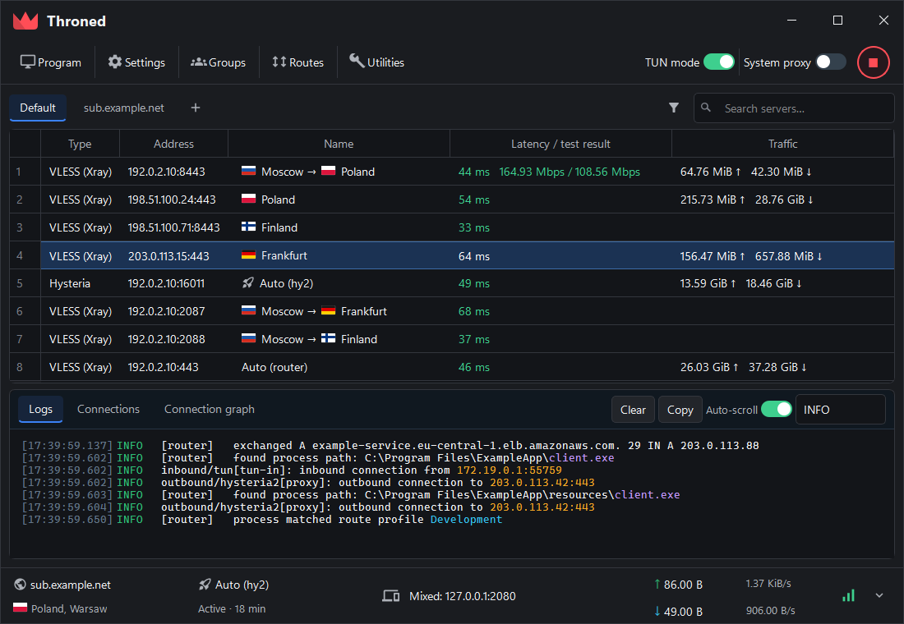
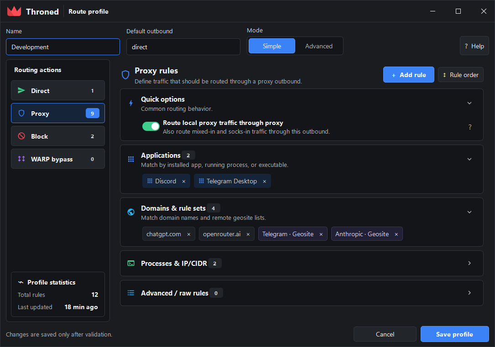
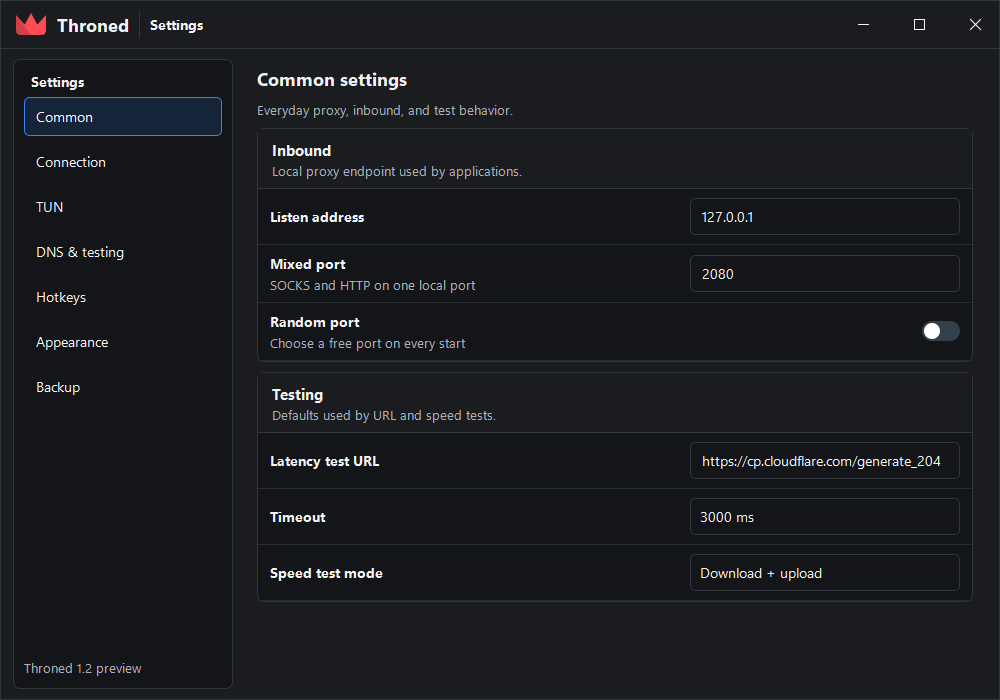
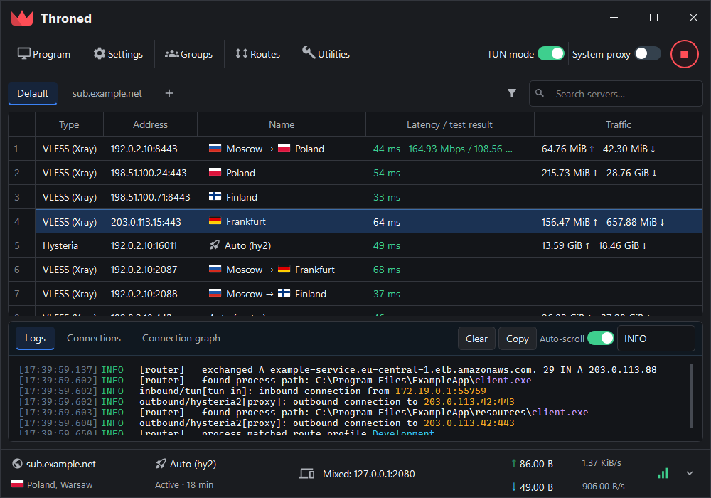
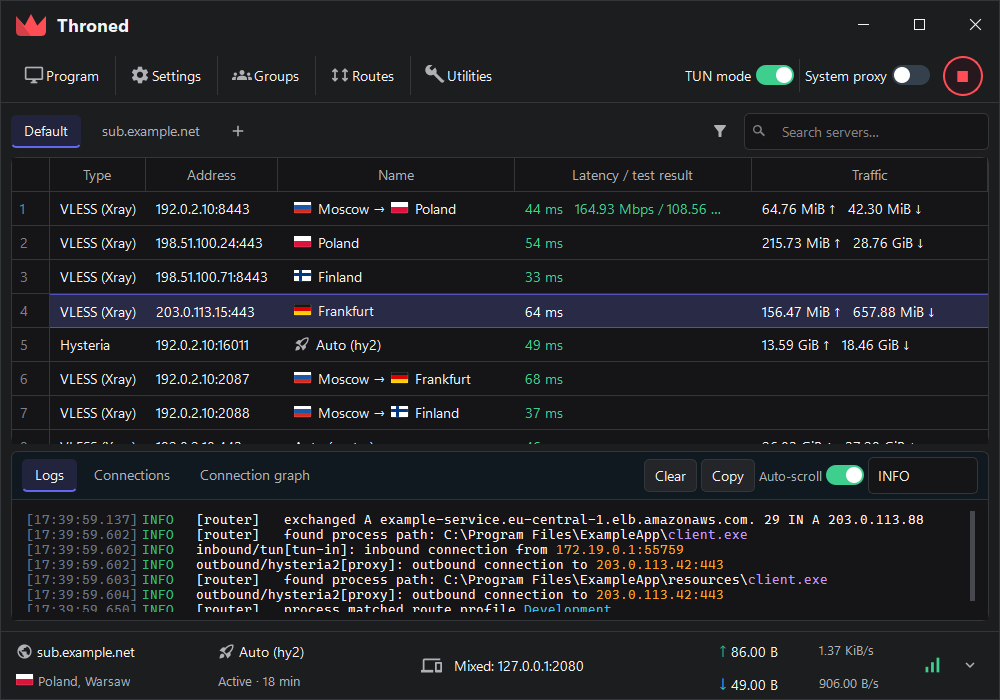
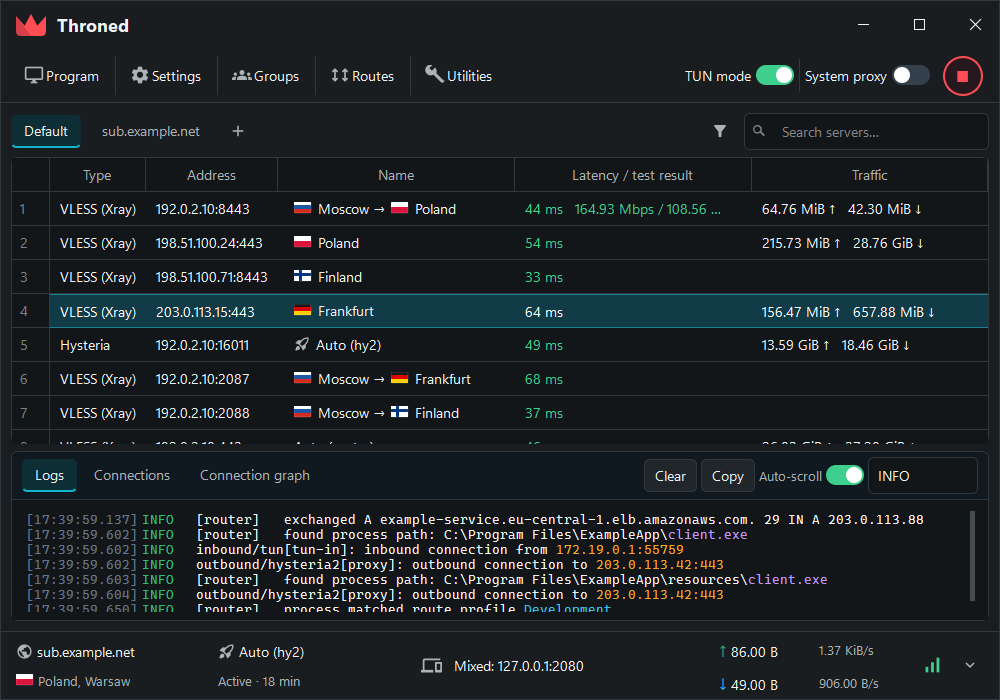
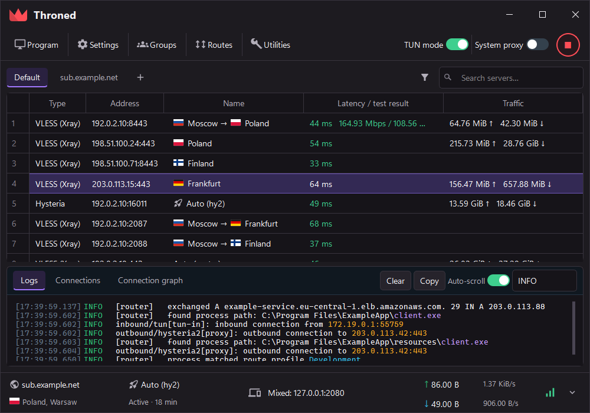
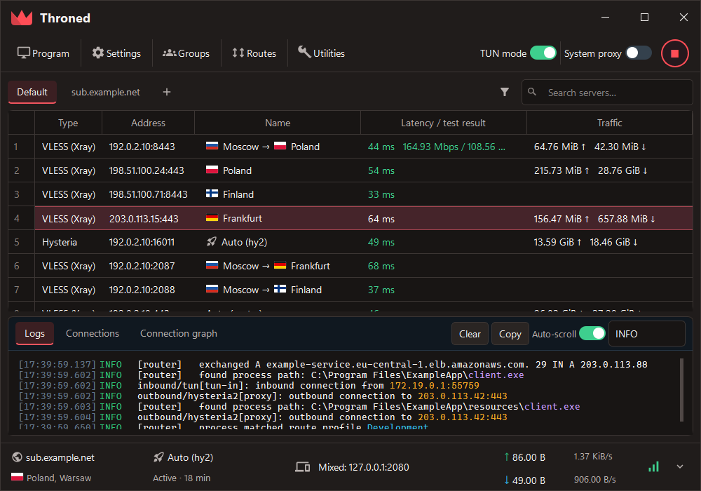

<p align="center">
  
</p>

<h1 align="center">Throned</h1>

<p align="center">
  A Qt desktop proxy client powered by sing-box and Xray —<br>
  my personal, unofficial fork of <a href="https://github.com/throneproj/Throne">Throne</a>.
</p>

<p align="center">
  <a href="https://github.com/troshkindm/throned/releases"></a>
  <a href="LICENSE"></a>
  
</p>

---

## Why this fork exists

I maintain Throned because I wanted to fix a few problems that affected me
directly, test those changes on Windows and Linux, and publish installers I can
actually use without waiting for a particular upstream release.

This project uses AI-assisted tools extensively while developing, reviewing, and
documenting changes. I still test releases before publishing them, but this is a
personal best-effort project — not an official Throne build, and not a promise of
support. If you need the upstream project and its support channels, please use
[Throne](https://github.com/throneproj/Throne). Throned is provided as-is,
without warranty.

---

## Interface

Throned 1.2 replaces the inherited Qt forms with a redesigned shell: a frameless
window with its own chrome, a single header band instead of stacked panels, and
one set of semantic color tokens shared by every screen.

<p align="center">
  
</p>

Routing gets a **Simple** mode that groups rules into application, domain,
process and network cards, and an **Advanced** mode that exposes the real
ordered rule list where the first match wins.

<p align="center">
  
</p>

Settings are grouped into sections with inline help instead of a dense grid of
checkboxes.

<p align="center">
  
</p>

> Screens are rendered by the bundled preview harness (`tools/ui-demo`). They
> show the shipped layout and palette; every server, host and path in them is
> placeholder data using the reserved documentation ranges from RFC 5737.

### Themes

Five built-in themes, switchable in **Settings → Appearance**. The background
ramp stays close to neutral in all of them and the chroma budget goes to the
accent instead, which keeps text edges crisp — a uniformly tinted dark window at
low luminance contrast reads as slightly out of focus.

| Midnight | Graphite |
| --- | --- |
|  |  |

| Ocean | Violet | Ember |
| --- | --- | --- |
|  |  |  |

---

## What Throned adds

### Windows TUN self-loop fix

Throned addresses an intermittent Windows TUN self-loop. After a
network-interface change, an internal sing-tun system-stack connection could
fall through to `direct`, get captured by the same TUN again, and repeat
indefinitely. Typical symptoms:

- Discord or in-game voice chat suddenly stopping;
- repeated `ThronedCore.exe -> 172.19.0.2:<port>` log entries
  (`ThroneCore.exe` on builds before `1.1.0`);
- increased CPU or memory use;
- temporarily recovering after restarting TUN mode.

Throned updates sing-tun with the upstream interface-monitor fix and adds an
early peer guard calculated from the configured TUN subnet, so custom TUN ranges
are protected too. DNS requests to the peer remain hijacked normally; other
recaptured peer traffic is dropped before sniffing, user rules, or a direct
outbound can loop it again.

### Rule-set downloads that follow the proxy

Remote sing-box rule sets and Throned's own route/GeoIP/GeoSite downloads use
the active proxy through a dedicated authenticated local inbound. They no longer
depend on a routing profile's `final` outbound being set to `proxy`.

### Routing editor

- Simple and Advanced modes over one shared rule document; switching modes never
  deletes, regroups, or silently reorders rules.
- An application picker backed by installed applications, running processes, and
  manual executable selection.
- Unknown imported fields stay as opaque JSON in their original position and get
  a visible `Preserved JSON` marker.

### Main window workflow

- Selecting several rows reveals batch actions — URL test, speed test, and
  outbound-IP resolution operate on the preserved selection.
- Logs wrap at the window edge with a hanging timestamp/level gutter, a level
  filter, and auto-scroll.

### Naming and migration

The application, core process, installer, Linux bundle, and TUN interface all
use the Throned name. On first launch, an existing Throne configuration is
copied into Throned when no Throned database exists yet. The legacy `throne://`
link scheme remains supported, so old subscriptions and shared profiles keep
opening.

---

## Downloads

Stable builds are published on the
[Releases](https://github.com/troshkindm/throned/releases) page.

| Platform | Package | Status |
| --- | --- | --- |
| Windows x64 | Installer EXE | Recommended |
| Windows x64 | Portable ZIP | Supported |
| Linux x64 / ARM64 | Portable ZIP | Supported |
| Debian/Ubuntu x64 / ARM64 | Bundled-Qt DEB | Recommended |
| Debian/Ubuntu x64 / ARM64 | System-Qt DEB | Smaller package; uses distro Qt |
| Windows ARM64 / legacy Windows | Not currently published | Planned |
| macOS | Build from source | Upstream-compatible, not CI-tested here |

TUN mode requires administrator privileges on Windows and elevated network
capabilities on Linux.

---

## Versioning and releases

Throned uses ordinary numeric [Semantic Versioning](https://semver.org/):

- patch fixes — `1.0.1`, `1.0.2`;
- backward-compatible features — `1.1.0`;
- incompatible changes — `2.0.0`.

Each release note states which Throne version or commit it is based on. A
release is published only after the Windows x64 installer, Windows portable
build, Linux x64/ARM64 portable builds, and all four Debian packages complete
successfully. Development builds remain available as GitHub Actions artifacts.

The `1.1.0` release also publishes legacy-named transition archives solely so
the `1.0.0` updater can hand over to Throned. New installations and later
updates use the `Throned-*` packages.

---

## Building

The authoritative build recipes live in
[.github/workflows/throned-windows.yml](.github/workflows/throned-windows.yml).
They build `ThronedCore`, the Qt application, and portable packages in clean
GitHub runners.

The project currently expects:

- Go 1.26.x
- CMake and Ninja
- Qt 6.11.x
- Protobuf 31.x
- MSVC on Windows or GCC on Linux

The UI preview harness builds on its own against Qt alone, without a database,
core process, or networking side effects:

```sh
cmake -S tools/ui-demo -B build-ui
cmake --build build-ui
```

See [docs/ui-redesign.md](docs/ui-redesign.md) for its options and the design
notes behind the redesign.

---

## Supported protocols

Throned inherits Throne's sing-box and Xray protocol support, including VLESS,
VMess, Trojan, Shadowsocks, SOCKS, HTTP(S), TUIC, Hysteria, Hysteria2, AnyTLS,
WireGuard/AmneziaWG, SSH, Mieru, NaiveProxy, Juicity, TrustTunnel, custom
outbounds, custom configs, chains, and extra cores.

---

## Upstream policy

Upstream changes are periodically merged from
[throneproj/Throne](https://github.com/throneproj/Throne). Throned-specific
patches are kept small and documented so they can be rebased, retired when
upstream supersedes them, or proposed upstream where appropriate.

Bug reports should include the Throned version, operating system, TUN settings,
routing profile, and the log section from when the problem occurs.

---

## Credits and license

Throned is built on the work of
[Throne](https://github.com/throneproj/Throne),
[sing-box](https://github.com/SagerNet/sing-box),
[Xray-core](https://github.com/XTLS/Xray-core), Qt, and the other projects
listed in the source tree.

Licensed under [GPL-3.0](LICENSE).
